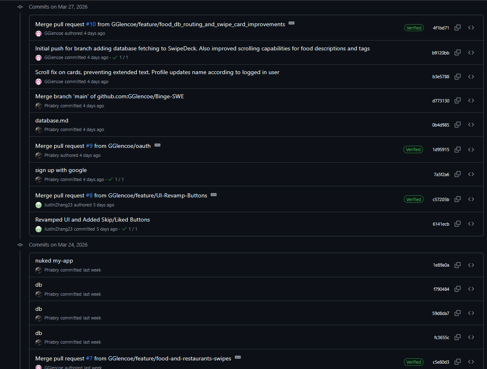
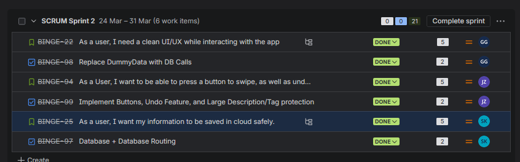
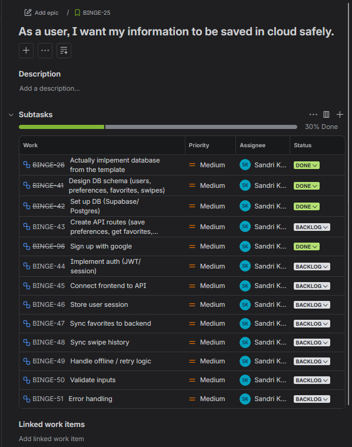

# Aleksandre Khvadagadze — Sprint 2 Individual Deliverables

---

## Personal Code Contribution

My work this sprint covered BINGE-25 and BINGE-97 — the entire backend: database design, authentication, and API layer.







**What I built:**

I created the Supabase database from scratch with 5 tables (`profiles`, `user_preferences`, `foods`, `swipes`, `favorites`), each with Row Level Security so users can only access their own data. I also added database triggers — the most useful one auto-creates a profile row whenever a new user signs up, so we never have to do that manually.

On top of that I built all the API routes: profile, preferences, swipes, favorites, recommendations, and a health check. I also wrote `lib/auth.ts` with a `requireUser()` helper that all protected routes use to check the session and return a 401 if the user isn't logged in.

For authentication, I implemented Google sign-in using Supabase Auth — added the button to the login page and wrote the OAuth callback route. The full flow (click → Google → callback → profile auto-created → redirect to app) works end-to-end.

Finally I wrote `DATABASE.md`, a guide for teammates on how to use the database and API routes with copy-paste fetch examples.

---

## Test Cases

My testing focused on the database integration since that was the riskiest new piece.

**Health check** — I built `/api/health` specifically as a sanity check after schema changes. It runs a live query and returns `{ ok: true }` or an error with detail.

```bash
curl http://localhost:3000/api/health
# { "ok": true, "url": "https://..." }
```

**Auth flow** — After implementing Google OAuth I manually stepped through the full signup: click sign in → Google consent → callback → session created → profile row appears in Supabase dashboard → redirected to `/recipes`. I ran this a few times with different Google accounts to confirm the trigger reliably created the profile.

**API routes** — I tested each route I wrote using the browser network tab and curl while running the dev server.

```bash
# Profile update
curl -X PUT http://localhost:3000/api/users/me \
  -H "Content-Type: application/json" \
  -d '{"display_name": "Alex", "location": "St. Louis, MO"}'

# Preferences upsert (ran twice to confirm it updates, not duplicates)
curl -X PUT http://localhost:3000/api/users/me/preferences \
  -H "Content-Type: application/json" \
  -d '{"cuisine_interests": ["Italian", "Mexican"], "price_range": 2}'
```

**RLS check** — I tried querying another user's data directly through Supabase to confirm the Row Level Security policies were working. The response was an empty array, not an error — the policy silently filters it out, which is the correct behavior.

**Dummy → real data** — Garrett's frontend was built against `DummyData.tsx`. After seeding the real database with matching data, I confirmed no frontend changes were needed — the shapes matched, meaning the schema design was correct.

---

## Code Review Summary

We did code reviews informally over Discord and VC rather than formal PR approvals. After finishing a feature, whoever built it would walk the others through it and we'd discuss what could be improved.

**Garrett's SwipeDeck DB integration (BINGE-98):** Garrett was calling Supabase directly from the component. I suggested moving it to the API route layer so the frontend stays clean and credentials stay server-side. I also flagged that the `food_id` values from `DummyData.tsx` were strings like `"f1"` — the real database uses UUIDs, so that would silently fail once we switched. We caught it before it became a problem.

**Justin's Undo button (BINGE-99):** The implementation used client-side state to reverse swipes, which worked with dummy data but won't work against the real database — Undo needs a `DELETE /api/swipes/:foodId` endpoint that doesn't exist yet. I flagged it and it became a Sprint 3 action item.

**My own routes reviewed by team:** Garrett caught that my preferences `GET` route would 500 when a new user had no preferences yet — the `.single()` call throws on no rows. I updated it to return `null` gracefully instead.

---

## Individual Reflection

Sprint 2 was the heaviest backend work for me. I built the database, auth, and API layer from scratch over the course of the sprint, which meant my work was a dependency for everyone else's frontend changes.

The most rewarding part was getting the Google auth flow working end-to-end. There are several moving pieces — the Supabase Auth config, the OAuth callback, the database trigger — and when they all worked together on the first real test signup it was a good feeling.

The biggest challenge early on was getting the database to connect at all. The health check kept returning unhealthy and I spent a while debugging — checking env variables, the Supabase client config, Next.js setup. Eventually I concluded the Supabase project itself was misconfigured and the cleanest fix was to delete it entirely and create a new one from scratch. Once I did that and rewired the environment variables, everything connected immediately. Not the most elegant solution but it got us unblocked. The other challenge was coordinating data shapes with Garrett since his frontend was built against flat dummy objects while my database used UUIDs and arrays. We worked through it but it took a few back-and-forths.

The Undo feature is something I feel partially responsible for. The `swipes` table uses an upsert pattern, which means swiping again just overwrites the direction — it doesn't delete. That was the right design for re-swiping, but it means Undo can't work without a DELETE endpoint. Justin's button worked in dummy-data mode but will be broken against the real DB until we build that route. That's on me for not thinking through the Undo use case when I designed the table.

The biggest thing I took away from this sprint is that database design decisions downstream affect everyone else on the team. I spent extra time getting the schema right upfront — RLS policies, auto-triggers, upsert constraints — and that mostly paid off. Writing `DATABASE.md` while building also helped me catch my own inconsistencies before they became bugs.
